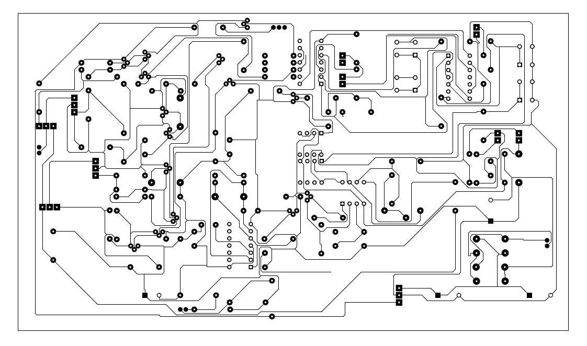
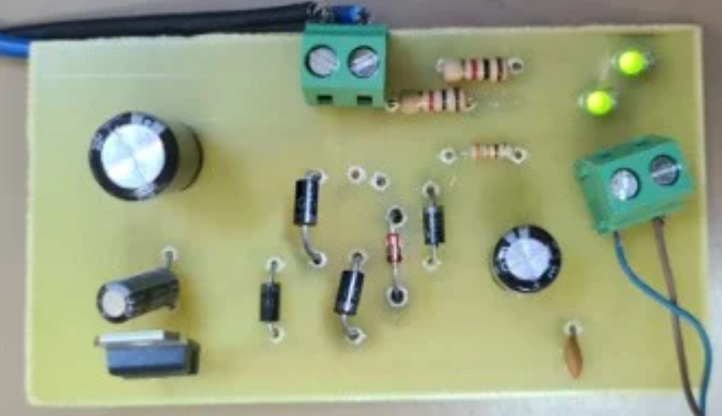
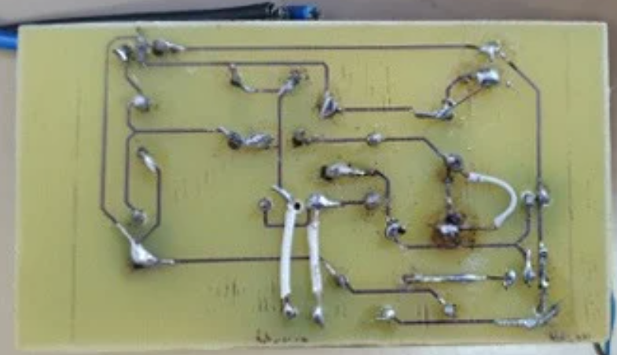

<p align="center">
A complete DC Motor Variable Speed Drive (VSD) designed using analog electronics, featuring PWM speed control, bidirectional motor control, PCB design, fabrication, and hardware validation.
</p>

---

#  Overview

This project presents the design and implementation of a **Variable Speed Drive (VSD)** for a DC motor using **Pulse Width Modulation (PWM)**.

The project covers the complete engineering workflow, including:

- Electronic circuit design
- Component sizing and theoretical calculations
- Circuit simulation in Proteus
- PCB schematic capture
- PCB routing
- PCB fabrication
- Component soldering
- Hardware testing and validation

The final system allows precise control of both the **speed** and **rotation direction** of a DC motor while ensuring stable operation through a regulated power supply and protection circuitry.

---

#  Features

- PWM-based DC motor speed control
- Forward and reverse motor rotation
- Start, Stop and Emergency Stop functions
- Stable regulated 12 V power supply
- Electrical protection circuitry
- Complete PCB design and routing
- Circuit simulation before fabrication
- Hardware implementation and testing

---

#  Project Architecture

The Variable Speed Drive is composed of the following functional blocks:

- Power Supply & Voltage Regulation
- PWM Generator
- Control Logic
- Direction Control
- Protection Circuit
- H-Bridge Driver
- DC Motor Output

---

# Tools Used

| Tool | Purpose |
|------|---------|
| Proteus Design Suite | Circuit design, simulation, PCB layout and routing |

---

#  Main Components

- NE555 Timer
- LM358 Operational Amplifier
- LM393 Comparator
- CD4011 CMOS NAND Gate
- 7812 Voltage Regulator
- MOSFET Transistors
- Rectifier Diodes
- Zener Diodes
- Electrolytic Capacitors
- Potentiometer
- LEDs
- Heat Sink
- Resistors

---

#  Development Process

1. Requirement analysis
2. Component selection
3. Theoretical calculations
4. Circuit simulation
5. PCB schematic design
6. PCB routing
7. PCB fabrication
8. Component soldering
9. Hardware testing and validation

---

#  Project Preview

## PCB Layout

<p align="center">

</p>

<p align="center">
<i>PCB layout designed using Proteus.</i>
</p>

---


## Final Hardware

<p align="center">


</p>

<p align="center">
<i>Front and back views of the assembled Variable Speed Drive.</i>
</p>

---

# What I Learned

This project significantly strengthened both my theoretical knowledge and practical skills in electronics.

During its development, I learned:

- Analog electronic circuit design
- PWM generation using the NE555 timer
- Operational amplifier and comparator applications
- CMOS logic circuit implementation
- Voltage regulation and power electronics
- PCB schematic capture
- PCB routing techniques
- Electronic circuit simulation using Proteus
- PCB fabrication workflow
- Component soldering
- Hardware debugging and validation
- Technical documentation using LaTeX

---

#  Repository Structure

```text
.
├── Documentation/
│   └── Project_Report.pdf
├── Proteus/
│   ├── Simulation/
│   ├── PCB/
│   └── Schematic/
├── images/
│   ├── appendix_pcb_layout.png
│   ├── convertor_board_routing.png
│   ├── board.png
│   ├── final_board_realview_front.png
│   └── final_board_back.png
├── README.md
└── LICENSE
```

---

#  Future Improvements

- Design a compact double-layer PCB
- Implement microcontroller-based digital control
- Add closed-loop speed regulation
- Integrate overcurrent protection
- Improve thermal management

---

# Author

**Sara Bannour**

Electrical Engineering Student  
National Engineering School of Monastir (ENIM)

Interested in **Embedded Systems, Robotics, Automation, and Computer Vision.**

---

# 📄 License

This project is developed for **educational and research purposes**.
